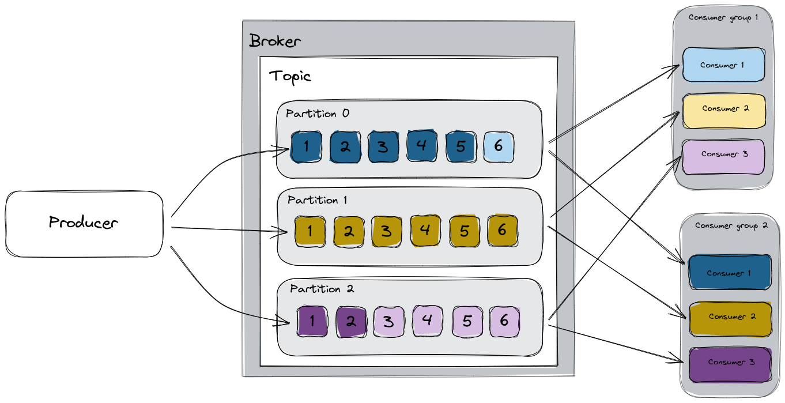

= Data streaming
include::_attributes.adoc[]

We talked about Kafka topic concept in a previous session. Now it's time to send and receive data from a topic. 

We must understand the consumer, producer and consumer groups to discuss the streaming data concept. 

[#producersandconsumers]
== Producers and consumers

The following image shows a topic structure:

image::topic-structure.png[Topic structure]

A **producer** is an application that sends data to a topic. If a topic has more than one **partition**, Kafka balances it along the partitions. Also, each partition is replicated along the Kafka brokers depending on the replica factor number, although our application always writes the data in the leader partition. 

image::topic-producer.png[Topic producer]

The **consumer** is the application that receives the data from a topic partition. More than one application forms a **consumer group**.

image::topic-consumer-group.png[Topic consumer group]

A consumer group works as a unique functional unit, so the **offset** is unique for each. 

The **offset** is a point of the latest element consumed by a consumer group. One advantage of using Kafka is that if you modify the offset, the data can be reprocessed. 

These concepts are essential to have an optimized Kafka architecture. If we think of an optimal architecture, the ideal scenario would be to have the same number of partitions in a topic as applications in each consumer group. 

If we have more applications than partitions, some applications will do nothing. Oppositely, if we have more partitions than applications, the process won't be parallelized. 

The following image shows two optimized consumer groups with different offsets. 

[#simple]
== Simple data
Once, we've yet learned about Kafka concepts, it's time to play with it. 

We can work with many data types in Kafka, in this example, we're going to show the simplest way to work with simple text data. 

To do it, we need an application. We can use a lot of languages and frameworks, in this case, we're going to use Quarkus and Java 17. 

Also, we'll deploy a topic and users.

[#sendsimpledata]
=== Send plain text

Kafka works with serialized data, in this first lab we are going to send information as a string. This is the easiest way to send information, but also it is usually an ineffective way to work, as we often work with structured data. 

What do we need to send information to a topic?

* **Kafka cluster:** Cluster where create the topic and send the data. 
* **Application:** Kafka provides a lot of libraries to work in the most popular programming languages, in this case we've used Java 17 with Quarkus. 
* **Topic:** we'll create a topic to send the information. 
* **Kafka user: ** user with enough roles to write in the specific topic.

.Kafka Cluster

For this example, we'll create a simple cluster with internal and TLS security communication:

[source, yaml]
include::https://raw.githubusercontent.com/dbgjerez/workshop-amq-streams/master/content/data/simple/cluster-data-simple.yaml[]

And we can use ArgoCD or apply it directly:

[source, yaml]
....
oc apply -f content/data/simple/cluster-data-simple.yaml -n demo-data-simple
....

.Topic

It's very important to create a topic with the correct configuration. In this case, we are only going to see how to send data to it, so we only need one partition without a replica. 

The definition is here: 

[source, yaml]
include::https://raw.githubusercontent.com/dbgjerez/workshop-amq-streams/master/content/data/simple/topic-data-simple.yaml[]

Once we've applied the Kafka cluster definition, we can create the topic in similar way: 

[source, yaml]
....
oc apply -f content/data/simple/topic-data-simple.yaml -n demo-data-simple
....

.User

The next important step is to create the user who the application is going to use. This user needs enough roles to write in the previous topic. 

This is the corresponding definition, also we can see more about roles and acls in the security section:

[source, yaml]
include::https://raw.githubusercontent.com/dbgjerez/workshop-amq-streams/master/content/data/simple/producer/templates/producer-user.yaml[]

> NOTE: I've used Helm to deploy the applications, so you can see some variable placeholders which are overrides in deploy time by ArgoCD. 

The user will be created at the same time that the application is in the following step. 

.Application

Quarkus facilities the way to develop a native application container. The application that sends the data to Kafka is: https://github.com/dbgjerez/quarkus-kafka/tree/main/simple-kafka-producer

At this point, we must create some pieces: the deployment, service and user. 

I usually use ArgoCD and Helm to the facility for this step. If you can't use it, you can render the Helm chart with the following command: 

[source, yaml]
....
helm template -f demo.values.yaml -n demo-data-simple data/simple/producer | oc apply -f -
....

It's essential to understand the security, if we inspect the deployment file, we can see references to the secrets which contain the Kafka cluster certificates. 

[#receivesimpledata]
=== Receive plain text
// TODO

[#json]
== JSON data
// TODO write about a JSON strcutre data

[#sendjson]
=== Send JSON
// TODO 

[#receivejson]
=== Receive JSON
// TODO

[#avro]
== Avro schemes
// TODO write about a JSON strcutre data

* xref:04-data.adoc[4. Data]
** xref:04-data.adoc#simple[Simple data]
*** xref:04-data.adoc#sendsimpledata[Send plain text]
*** xref:04-data.adoc#receivesimpledata[Receive plain text]
** xref:04-data.adoc#json[JSON]
*** xref:04-data.adoc#sendjson[Send JSON]
*** xref:04-data.adoc#receivejson[Receive JSON]
** xref:04-data.adoc#avro[Avro scheme]